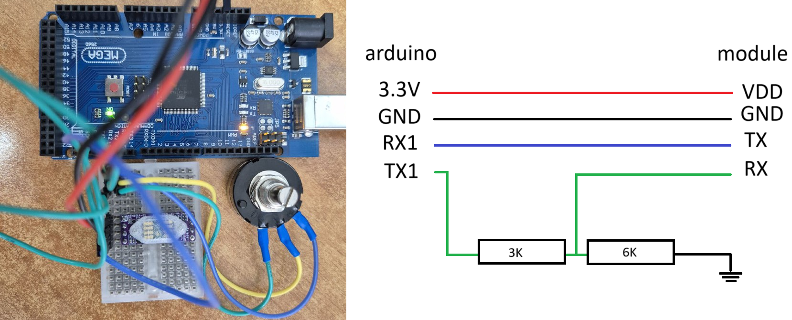

# Faraday-Ox Arduino Example

Example that shows how to interact with Faraday-Ox smart oxygen sensor module (FM25-O2xx) over UART from Arduino master.
Example is developed with ArduinoIDE.

```FaradayOxArduinoExample.ino``` - contains all the logic
```faradaic_registers.h``` - contains FaradaIC difines for the Module. Keep this file in the same folder as FaradayOxArduinoExample.ino

### Connection

Arduino has 5V voltage levels for the UART.
To not damage the module it is required to use either level shifter circuit or in minimal configuration voltage divider on Arduino TX1 pin to bring it down to 3.3V for module.

Connection scheme is:
ARDUINO 3.3V - MODULE VDD
ARDUINO GND - MODULE GND
ARDUINO TX1 - MODULE RX (Through voltage divider, I've used 3kOhm and 6kOhm to lower voltage to 3.3V)
ARDUINO RX1 - MODULE TX (Directly, Arduino RX triggers from 3.3V level)

